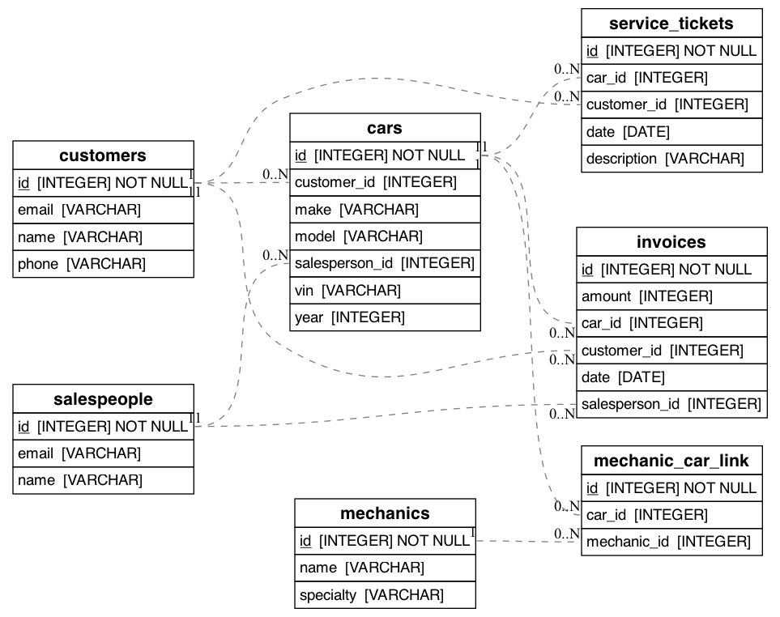

# Car Dealership DB

## Instructions:
1. Run schema: `python car_dealership_schema.py`
2. Load data: `sqlite3 car_dealership.db < insert_sample_data.sql`

---

## Entity Relationship Diagram (ERD)

---

## Table Breakdown

- **customers** – Buyer info including name, phone, and address.
- **salespeople** – Sales team and their contact info.
- **cars** – Inventory with VIN, make, model, year, and price.
- **invoices** – Sale records linking cars, customers, and salespeople.
- **mechanics** – Technicians and their specialties.
- **service_tickets** – Car service records tied to customers and mechanics.
- **mechanic_car_link** – Join table to show which mechanic serviced which car.

---
